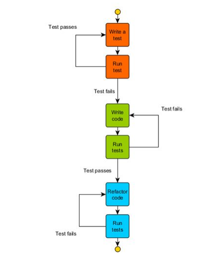

# Short Programming problems for practicing TDD

This is a subtitle

### Mobing Rules

**The Computer**

There is only one person typing and everyone in the Mob should be able to read the screen. The typist does not dictate what is typed

**Session Length**

Mob Kata sessions should be between 1.5 to 4 hours. If going longer than 1.5 hours a 10 minute break every hour is
recommended.

**Guiding Principles**

1. Make it work, Make it pretty, Make it fast
   - First make the code work
   - Then make it read like a story
   - Finally, make it quick where need be
2. Humility, Respect and Trust
   - Give and receive constructive criticism
   - Fail fast
   - Be open to growth

### Four Rules Of TDD

1. You are not allowed to write any production code unless it is to make a failing unit test pass.
2. You are not allowed to write any more of a unit test than is sufficient to fail; and compilation failures are
   failures.
3. You are not allowed to write any more production code than is sufficient to pass the one failing unit test.
4. You may only refactor code when all test are green.

### Red Green Refactor Cycle

